# 如何免費部屬你的網頁應用程式

## Steps

1. go to https://www.netlify.com/

2. click ***Sign up*** to creat an new account     
    - 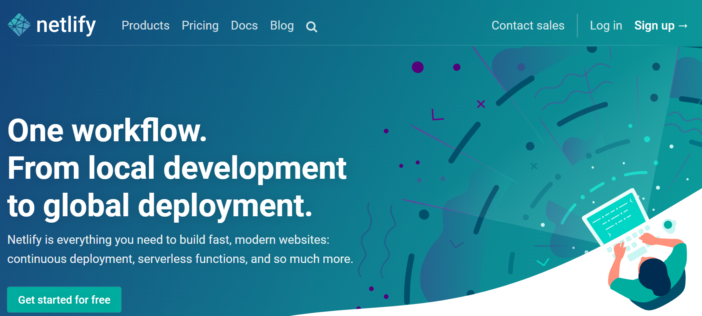

3. sign up with Github account
    - 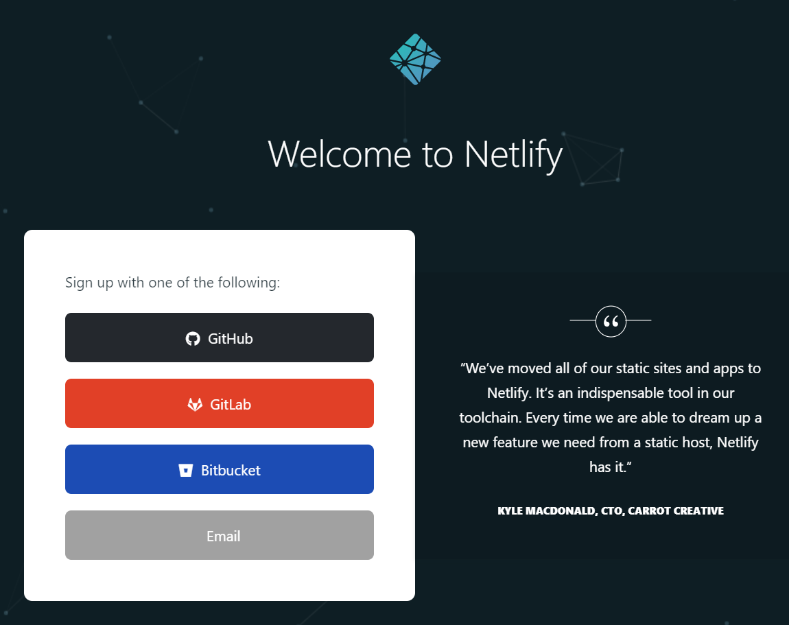

4. click ***New site from Git***
    - 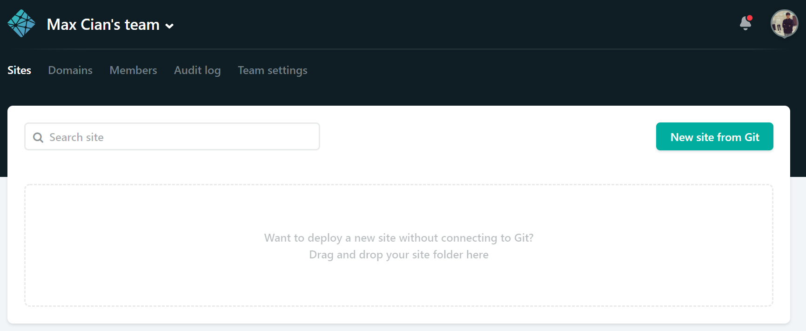

5. choose ***GitHub*** as provider
    - 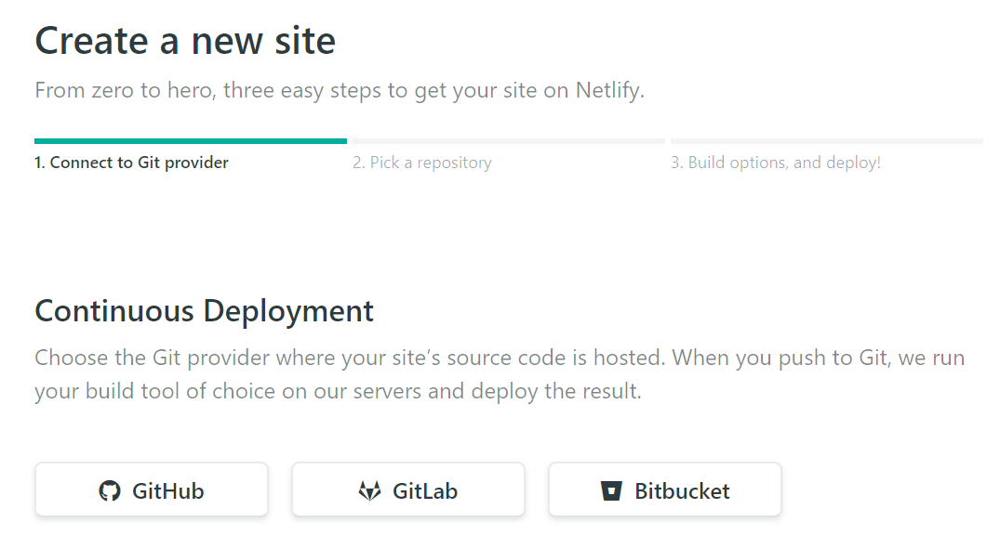

6. install Netlify integration tool
    - you can grant the Netlify to access your **All repositories** or **Only select repositories**, the following demo will use ***Only select repositories***
    - 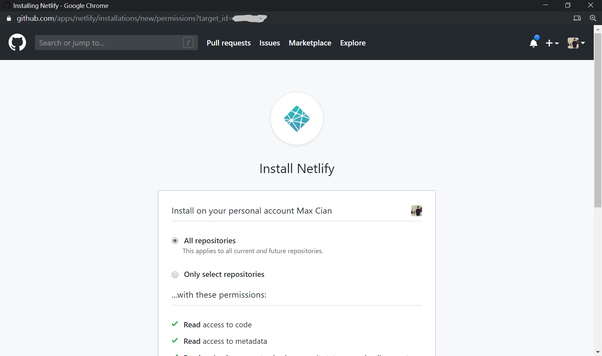
    - click ***Install***
    - 

7. pick a repo
    - now we have some repositories you have granted access to, click the repo you wan to deploy
    - 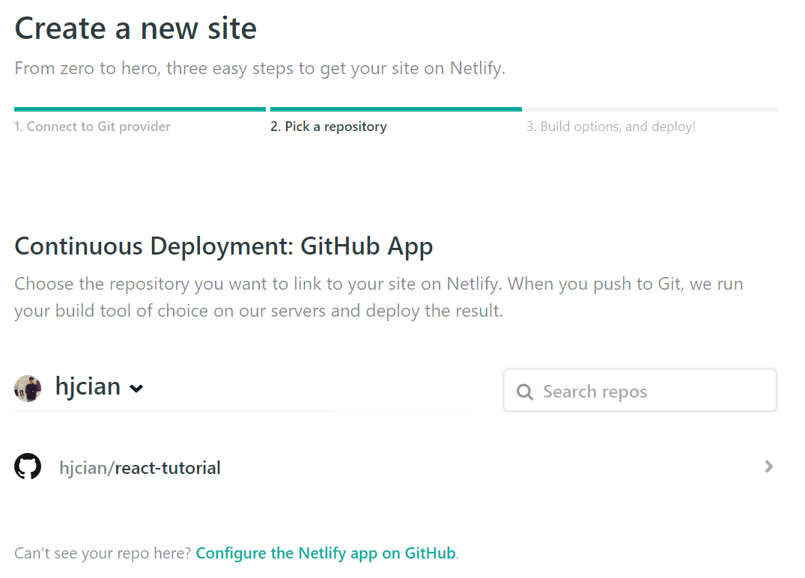

8. deploy site
    - 假設你使用 react-app 專案，則可使用預設的 `yarn build` 來部屬，所有設定都使用預設即可
    - click Deploy site
    - 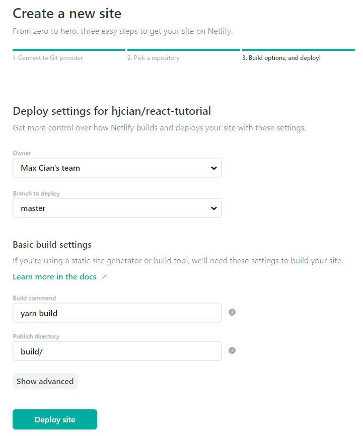

9. customize your domain
    - 接著會顯示部屬中
    - 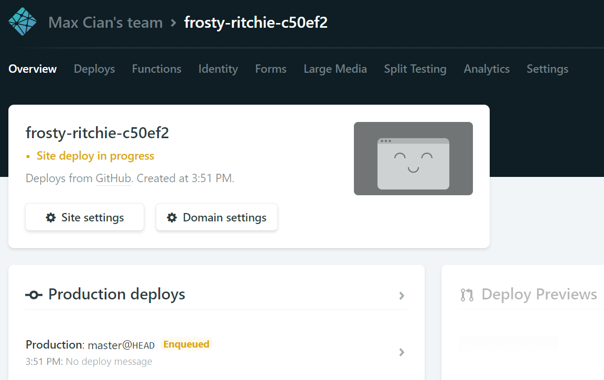
    - 部屬完的樣子
    - 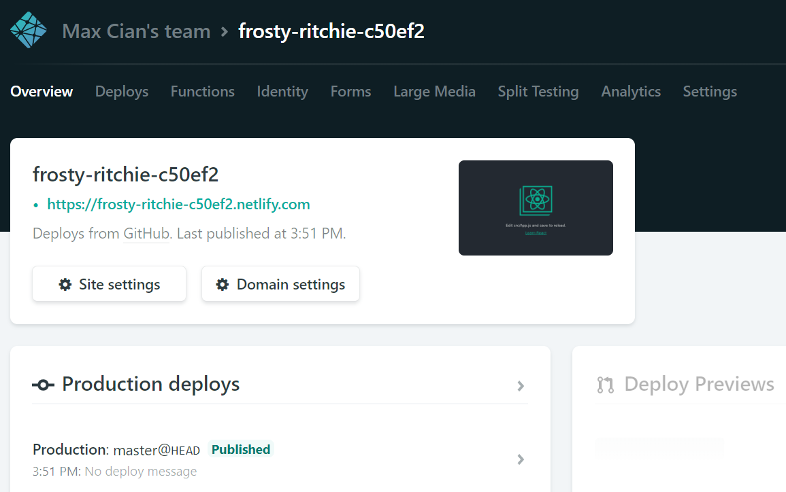
    - 客製化你的網域，於上圖中click ***Domain settings***，來到下圖，接著隨機產生的網域右邊有個 ***Options*** 圖示，click it
    - 接著就 click ***Edit site name***
    - 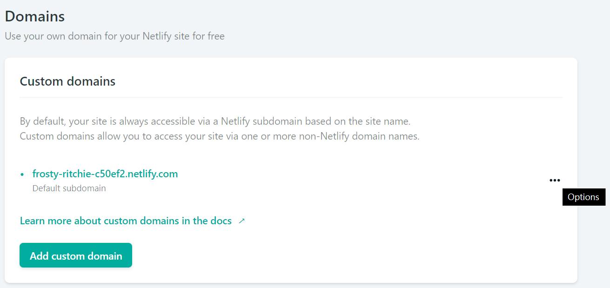
    - 取一個容易記憶的 sub domain name，然後 click ***Save***
    - 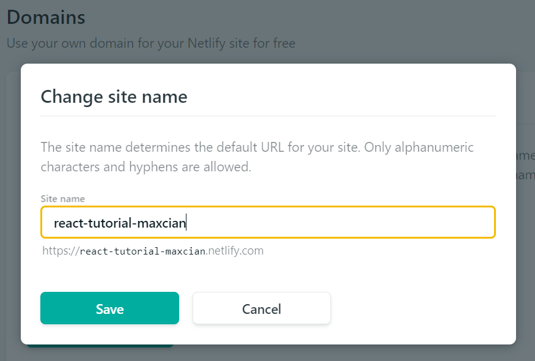
10. done, check your site in browser
    - 接著可以看到資訊卡上的網域皆變成你想要的網域
    - 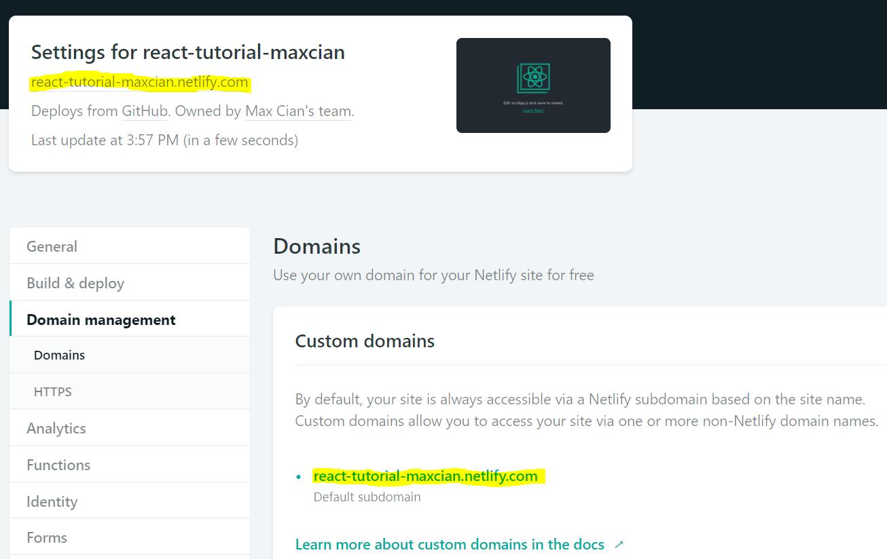
    - click the highlighted URL ([my site](https://react-tutorial-maxcian.netlify.com/)) to your site，可以在 URL bar 上看到已可以連向你客製的網址
    - 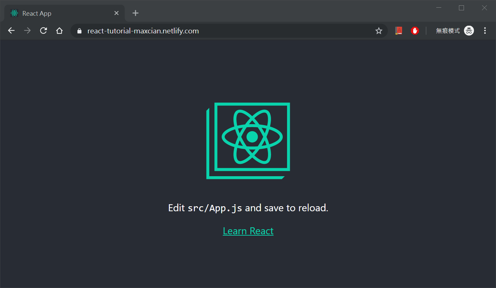
