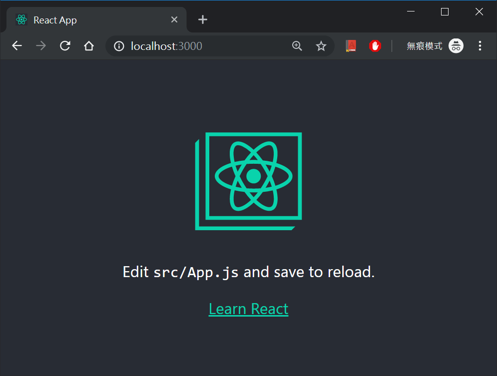

# 如何開始你的第一個 React 專案
## Prerequisites
- 安裝 node/npm ([install](https://nodejs.org/en/download/))
- 安裝 create-react-app ([package page](https://www.npmjs.com/package/create-react-app))
    - `npm i -g create-react-app`    
- 安裝 yarn ([install](https://yarnpkg.com/lang/en/docs/install/#mac-stable))
- 安裝 VS Code ([install](https://code.visualstudio.com/download)
    - 跨平台開發
    - 豐富插件加速開發
- VS Code extensions
    - StandardJS - JavaScript Standard Style
    - GitLens
- Basic Knowledge/Skills
    - common Linux command
        - ls
        - cp
        - cd
        - vim
    - Git
        - git clone
        - git add
        - git commit
        - git push
        - 結合使用 VS Code 的 Git 功能

## Steps
### 0. Prepare terminal environment
1. Windows 的話可直接使用 Git Bash
2. MacOS 則叫出原生的 terminal

### 1. Create a Github project and clone it
1. 去 [Github](https://github.com/) 創建專案
2. git clone 你的專案

***Terminal View***
```bash
$ git clone https://github.com/YourAccountName/YourProjectName.git
# Clone with HTTPS，輸入密碼吧！
$ cd YourProjectName
# 進入的你空專案，準備開始
```

### 2. Using create-react-app
1. 於目前路徑初始化 react 專案
2. 安裝完成後，目前僅需要以下兩種指令：
    - `yarn start`. Starts the development server. **開發中**，一律使用此指令開始工作
    - `yarn build`. Bundles the app into static files for production. **開發完**，將程式碼打包成可部屬的靜態檔案
3. 鍵入 `yarn start`，開啟 Hello React，應該會看到瀏覽器開啟以下畫面，就表示可以開始開發了。
    -    

***Terminal View***
```bash
$ create-react-app . 
# 安裝需要一段時間，會陸續噴出安裝過程，注意最後有四條指令的教學，目前只會用到 yarn start 與 yarn build
# ...
Success! Created react-tutorial at /your/path/to/YourProjectName
Inside that directory, you can run several commands:

  yarn start
    Starts the development server.

  yarn build
    Bundles the app into static files for production.

  yarn test
    Starts the test runner.

  yarn eject
    Removes this tool and copies build dependencies, configuration files
    and scripts into the app directory. If you do this, you can’t go back!

Happy hacking!
# ... 安裝完成後出現 Happy hacking!

$ yarn start
# 開啟 development server

```